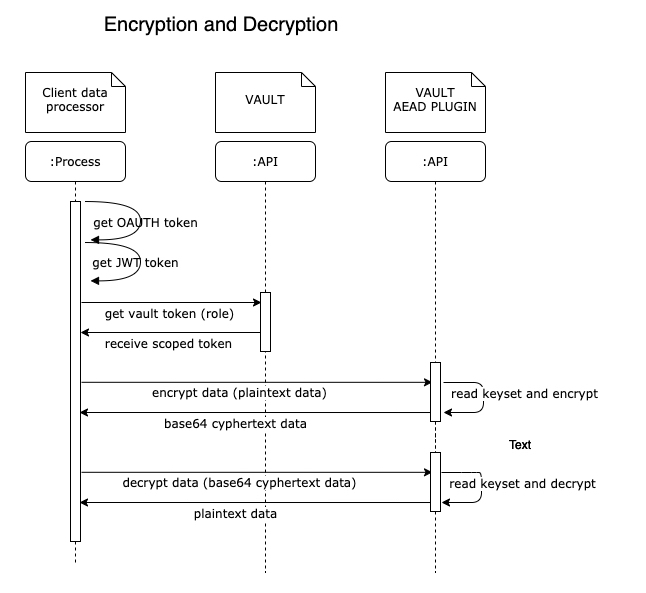
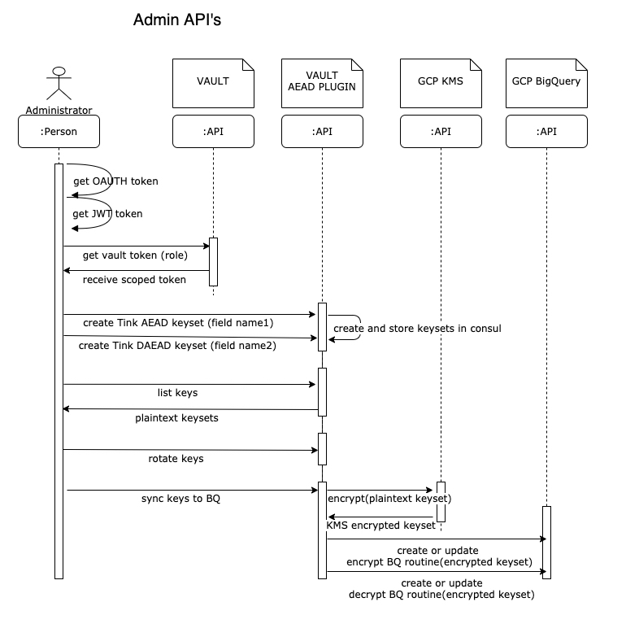
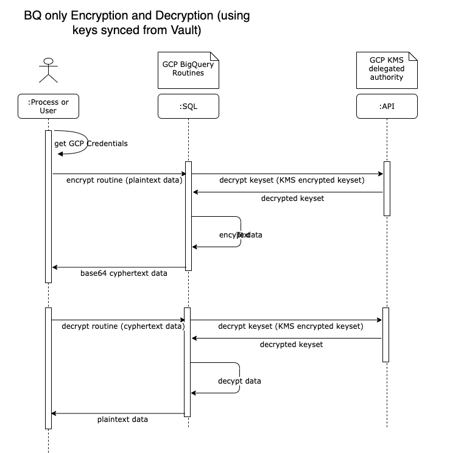
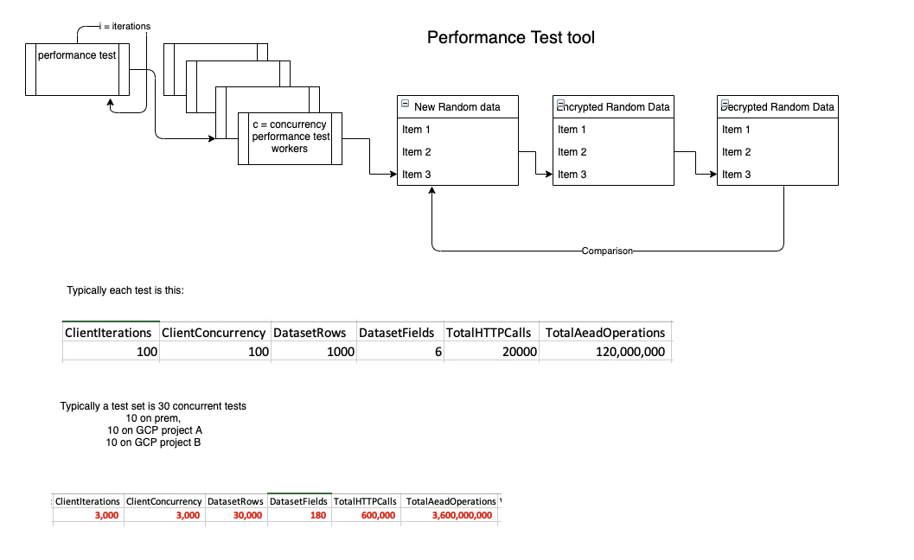
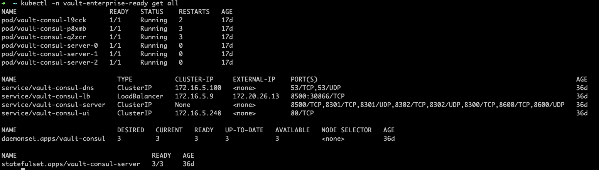
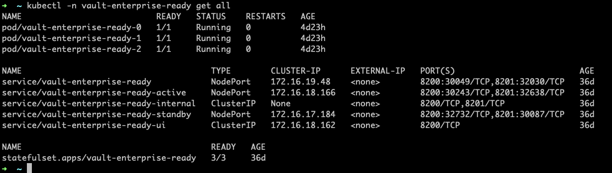

VAULT AEAD SECRETS PLUGIN
- [INSPIRATION](#inspiration)
- [HIGH LEVEL REQUIREMENTS](#high-level-requirements)
- [QUICK START](#quick-start)
  - [API endpoints](#api-endpoints)
    - [/info](#info)
    - [/config (read)](#config-read)
    - [/config (write)](#config-write)
    - [/createAEADkey](#createaeadkey)
    - [/createDAEADkey](#createdaeadkey)
    - [/encrypt](#encrypt)
    - [/decrypt](#decrypt)
    - [/encryptcol](#encryptcol)
    - [/decryptcol](#decryptcol)
    - [/rotate](#rotate)
    - [/keytypes](#keytypes)
    - [/bqsync](#bqsync)
  - [KEYSET EXAMPLE](#keyset-example)
  - [BULK DATA EXAMPLE](#bulk-data-example)
- [DESIGNS](#designs)
  - [Encrypt and Decrypt](#encrypt-and-decrypt)
  - [Admin API's](#admin-apis)
  - [BQ Encrypt and Decrypt](#bq-encrypt-and-decrypt)
- [PERFORMANCE TESTING](#performance-testing)
  - [Notes](#notes)
  - [Quick start](#quick-start-1)
      - [small test](#small-test)
      - [medium test](#medium-test)
      - [large test](#large-test)
  - [Options](#options)
- [INFRASTRUCTURE](#infrastructure)
  - [Consul](#consul)
  - [Vault](#vault)
- [LIMITATIONS AND TODO's](#limitations-and-todos)


# INSPIRATION

https://open.nytimes.com/we-built-a-plugin-but-its-not-a-secret-dfdf68b0e44f (an epiphany that we could use the config to store keys and implement something akin to transit engine using those keys)

https://learn.hashicorp.com/tutorials/vault/plugin-backends?in=vault/secrets-management

https://github.com/hashicorp/vault-guides/blob/master/plugins/vault-plugin-secrets-mock

https://www.youtube.com/watch?v=oV9rvDllKEg (Concurrency is not Parallelism by Rob Pike)


# HIGH LEVEL REQUIREMENTS

Houston we have a problem… we want to implement Google Tink encryption for PII data, but we have some specific and challenging requirements…

* To be able to use deterministic and non-deterministic keys to anonymise data (AES256GCMKeyTemplate and AESSIVKeyTemplate as defined in github.com/google/tink/go/keyset)
* To be able to encrypt and decrypt ad-hoc from BQ queries and DataStudio; To be able to decrypt in a client, data that has been encrypted in BQ, and visa versa, and similarly client-client and bq-bq: ie interoperability of keys
* To be able to encrypt and decrypt from ingestion frameworks based on dataproc, dataflow, cdap, 'a.n.other' client side process
* To be agnostic of where the client is; on-prem, GCP, AWS, Azure
* To be able to rotate keys and manage key lifecycle
* To have separate keys per field to be encrypted
* To have RBAC policies that allow separation of administration, encryption and decryption roles
* To have a rock-solid disaster recovery solution

And we need to do this at massive scale - just one of the typical data feeds is 350 files, each of 4 million rows of data, each with 6 fields to be encrypted. In 1 hour. Thats 8.4 billion encryptions in an hour, or a rate of 2.3 million per second. There are other shapes of data with less rows and more fields. Data comes in all shapes and sizes.
  

# QUICK START
```
git clone https://github.com/Vodafone/vault-plugin-aead.git
cd vault-plugin-aead
go test -v -cover -race
```

In one terminal
```
cd vault-plugin-aead
make
```
  
In another terminal
```
export VAULT_ADDR=http://127.0.0.1:8200

vault secrets enable -path=aead-secrets vault-plugin-aead
vault path-help aead-secrets
```

## API endpoints 
(note there are vault client CLI commands available too - "vault read/write aead-secrets/<endpoint>")

### /info
returns the plugin version number as json
```
curl -sk -X GET --header "X-Vault-Token: "${VAULT_TOKEN} ${VAULT_URL}/v1/aead-secrets/info
```

### /config (read)
returns the config as json - mostly keys. This is intended to be a restricted endpoint as it is in clear text. See  section on 'LIMITATIONS AND TODO's"
```
curl -sk -X GET --header "X-Vault-Token: "${VAULT_TOKEN} ${VAULT_URL}/v1/aead-secrets/config
```

### /config (write)
writes key : value to config
note this could overwrite an existing key
this can also be used to import a key
TODO - write a protected and unprotected endpoint
```
curl -sk --header "X-Vault-Token: "${VAULT_TOKEN} --request POST ${VAULT_URL}/v1/aead-secrets/config -H "Content-Type: application/json" -d '{"key":"value"}'
```

### /createAEADkey
creates a non deterministic keyset with 1 key of type github.com/google/tink/go/aead.AES256GCMKeyTemplate() for field "fieldname-nondet" and saves it to config
Note this will overwrite an existing keyset
TODO - write a protected and unprotected endpoint
```
curl -sk --header "X-Vault-Token: "${VAULT_TOKEN} --request POST ${VAULT_URL}/v1/aead-secrets/createAEADkey -H "Content-Type: application/json" -d '{"fieldname-nondet":"junktext"}'
```
### /createDAEADkey
creates a deterministic keyset with 1 key of type github.com/google/tink/go/daead.AESSIVKeyTemplate() for field "fieldname-det" and saves it to config
Note this will overwrite an existing keyset
TODO - write a protected and unprotected endpoint
```
curl -sk --header "X-Vault-Token: "${VAULT_TOKEN} --request POST ${VAULT_URL}/v1/aead-secrets/createDAEADkey -H "Content-Type: application/json" -d '{"fieldname-det":"junktext"}' 
```

### /encrypt
Lots of parallelisation. Splits bulk data into 1 goroutine per data row, and then every key:value pair is also a goroutine. So a file of 1000 rows and 6 fields is 6000 parallel goroutines.
Unanswered questions about whether thsi is really executed in parallel for bulk data when in a container.
Fields that do not have an encryption key are returned as-is and not errored
Note there is a 32Mb json restriction on http message size - the client is expected to handle this

```
curl -sk --header "X-Vault-Token: "${VAULT_TOKEN} --request POST ${VAULT_URL}/v1/aead-secrets/encrypt -H "Content-Type: application/json" -d '{"fieldname":"plaintext"}'
curl -sk --header "X-Vault-Token: "${VAULT_TOKEN} --request POST ${VAULT_URL}/v1/aead-secrets/encrypt -H "Content-Type: application/json" -d '{"fieldname1":"plaintext","fieldname2":"plaintext",...}'
curl -sk --header "X-Vault-Token: "${VAULT_TOKEN} --request POST ${VAULT_URL}/v1/aead-secrets/encrypt -H "Content-Type: application/json" -d 'BULK DATA - see below'

```

### /decrypt
Lots of parallelisation. Splits bulk data into 1 goroutine per data row, and then every key:value pair is also a goroutine. So a file of 1000 rows and 6 fields is 6000 parallel goroutines.
Unanswered questions about whether thsi is really executed in parallel for bulk data when in a container,
Fields that do not have an encryption key are returned as-is, and not errored
Note there is a 32Mb json restriction on http message size - the client is expected to handle this
```
curl -sk --header "X-Vault-Token: "${VAULT_TOKEN} --request POST ${VAULT_URL}/v1/aead-secrets/decrypt -H "Content-Type: application/json" -d '{"fieldname":"cyphertext"}'
curl -sk --header "X-Vault-Token: "${VAULT_TOKEN} --request POST ${VAULT_URL}/v1/aead-secrets/decrypt -H "Content-Type: application/json" -d '{"fieldname1":"cyphertext","fieldname2":"cyphertext",...}'
curl -sk --header "X-Vault-Token: "${VAULT_TOKEN} --request POST ${VAULT_URL}/v1/aead-secrets/decrypt -H "Content-Type: application/json" -d 'BULK DATA - see below'
```

### /encryptcol
Column based encryption or decryption. Intended for bulk data only. Pivots the bulk data into columns - then parellizes 1 row (aka field) ata  time, re-pivots before returning
So a file of 1000 rows and 6 fields is 6 parallel goroutines.
```
curl -sk --header "X-Vault-Token: "${VAULT_TOKEN} --request POST ${VAULT_URL}/v1/aead-secrets/encrypt -H "Content-Type: application/json" -d 'BULK DATA - see below'
```

### /decryptcol
Column based encryption or decryption. Intended for bulk data only. Pivots the bulk data into columns - then parellizes 1 row (aka field) ata  time, re-pivots before returning
So a file of 1000 rows and 6 fields is 6 parallel goroutines.
```
curl -sk --header "X-Vault-Token: "${VAULT_TOKEN} --request POST ${VAULT_URL}/v1/aead-secrets/decrypt -H "Content-Type: application/json" -d 'BULK DATA - see below'
```

### /rotate
Spin through all the keys and rotate them. The config endpoint should show rotated keys
```
curl -sk --header "X-Vault-Token: "${VAULT_TOKEN} --request POST ${VAULT_URL}/v1/aead-secrets/rotate
```

### /keytypes
Spin through all the keys and return DETERMINISTIC or NON_DETERMINISTIC

```
curl -sk -X GET --header "X-Vault-Token: "${VAULT_TOKEN} ${VAULT_URL}/v1/aead-secrets/keytypes
```

### /bqsync
Sync keysets to a defined BQ dataset so the same key can be wholey used in BQ
Consider this a draft endpoint for now. It functionally works fine, but...
1. It hard-codes the project and BQ dataset to place the routines in and the KMS to use - consider using config for this too
2. The Determinstic BQ stuff is not GA from Google - you have to have the projects(s) whitelisted


```
curl -sk --header "X-Vault-Token: "${VAULT_TOKEN} --request POST ${VAULT_URL}/v1/aead-secrets/bqsync
```


## KEYSET EXAMPLE
Note that a keyset for 1 field, with in this case 2 keys looks like this (this is not in use - so safe to publish here):

```
{
  "primaryKeyId": 1945832436,
  "key": [
    {
      "keyData": {
        "typeUrl": "type.googleapis.com/google.crypto.tink.AesSivKey",
        "value": "EkAfBnBWWzhrQ1/qCI6JlkaOBDyIWiiTU6ACE7dIy6zf3eMbTSlthSyfGx59fAnud/C7W4mht77MWgrwAYjmTC1z",
        "keyMaterialType": "SYMMETRIC"
      },
      "status": "ENABLED",
      "keyId": 1502426463,
      "outputPrefixType": "TINK"
    },
    {
      "keyData": {
        "typeUrl": "type.googleapis.com/google.crypto.tink.AesSivKey",
        "value": "EkDGZLv9Qi6Xsk7GNC3J8mIx2B6pGAuEr5nM8aN6q5MkMto22s6wU+BNYLgwsq4+qrbxzDdhPArAx5RCBYBd/16C",
        "keyMaterialType": "SYMMETRIC"
      },
      "status": "ENABLED",
      "keyId": 1945832436,
      "outputPrefixType": "TINK"
    }
  ]
}
```


## BULK DATA EXAMPLE

See performance.go makeRandomData() for an example of how to create bulk data 


```
{"0":{"field0":"value00","field1":"value01","field2":"value02"},"1":{"field0":"value10","field1":"value11","field2":"value12"},"2":{"field0":"value20","field1":"value21","field2":"value22"}}
```

or more explicitly

```
{
	"0": {
		"field0": "value00",
		"field1": "value01",
		"field2": "value02"
	},
	"1": {
		"field0": "value10",
		"field1": "value11",
		"field2": "value12"
	},
	"2": {
		"field0": "value20",
		"field1": "value21",
    "field2": "value22"
	}
}
```

if the column based endpoints are used, internally this will be pivoted to the below, and the pivoted back so it is transparent to the client

```
{
	"field0": {
		"0": "value00",
		"1": "value01",
		"2": "value02"
	},
	"field1": {
		"0": "value10",
		"1": "value11",
		"2": "value11"
	},
	field2": {
		"0": "value20",
		"1": "value21",
    "2": "value22"
	}
}
```


The code identifies that we are dealing with bulk data because the first key of the first element is "0" (ie row zero.) TODO - there must be a better way - maybe make an explicit endpoint and let the client decide
Note that in Vault, data is passed in and returned back as...

```
map[string]interface{}
```

For a set of key:value pairs such as this...
```
curl -sk --header "X-Vault-Token: "${VAULT_TOKEN} --request POST ${VAULT_URL}/v1/aead-secrets/decrypt -H "Content-Type: application/json" -d '{"fieldname1":"cyphertext","fieldname2":"cyphertext",...}'
```
where the keys are the fields and the values are the text - in other words tha map is asserted to be...
```
map[string]string
```

However, for bulk data it is still of type...
```
map[string]interface{}
```
but interface{} is actually another map - so it is asserted to be...
```
map[string]map[string]string
```


# DESIGNS
## Encrypt and Decrypt



## Admin API's



## BQ Encrypt and Decrypt
Using the keys synced over using the bqsync endpoint



The purpose of this is not to dwell on the BQ side of things but the bqsync endpoint puts the SAME KEY into BQ so that operations like this can be done
```
select "value1" as ORIGINAL,
        pii_dataset_eu.pii_aead_field0_encrypt("value1",'field0') as ENCRYPTED,
        pii_dataset_eu.pii_aead_field0_decrypt(pii_dataset_eu.pii_aead_field0_encrypt("value1",'field1'),'field1') as ENCRYPTED_DECRYPTED
```
**in other words, a value encrypted in the vault api, can be decrypted in a BQ function, and vice versa**


# PERFORMANCE TESTING

**5 Million encryptions/decryptions per second have been achieved with a large performance test rig and pods of 300 x 8 CPU**
- this claim needs to be independently verified



## Notes
I can't honestly say this was designed from the ground up, it sort of evolved into a bit of a swiss army knife. It's almost certainly not a reference implementation of a test framework, it assumes happy path, and I wouldn't dream of using it in production. But it is enough for now.

Having said that - it does some cool things in quite a hacky way - inspecting the spec of the client machine, inspecting the spec and number of k8s pods, gathering average kube metrics, saving the results

Also, it does have, and needs, 2 exponential backoff retrys - because all sorts of things can happen in distributed computing
1. uses Hashi's http retry client so that http errors are caught and retried - test this by putting an invalid url for vault in
2. uses Go's retry package to wrap the http retry, so that errors returned from vault (but that are successfull http call) are retried - put an invalid token in to see this in action.

**BEFORE TESTING - DON'T FORGET TO SET THE KEYSETS UP FIRST USING THE createAEADkey or createDAEADkey for each field 'field0....fieldn'**
## Quick start
```
git clone https://github.com/Vodafone/vault-plugin-aead.git
cd vault-plugin-aead/cmd/performance
go build
(or if destined for Linux: env GOOS=linux GOARCH=amd64 go build)
```

#### small test 
(-d = debug mode to see what is going on)
6 fields, 3 rows, 2 concurrent processes, 1 iteration, bulk mode, column based end point
```
./performance -f 6 -r 3 -c 2 -i 1 -t <token> -u <https://url> -b -col -d
```

#### medium test
```
./performance -f 6 -r 1000 -c 100 -i 10 -t <token> -u <https://url> -b -col
```

#### large test
30x concurrent execution of (hint use the -w option to set the same UTC start time for all runs)
typically...
10 from on prem
10 from project a, instance group of 10 vm's
10 from project b, instance group of 10 vm's

**NOTE the -s switch - you will need to have a table created and writable - see results-table.ddl**

```
./performance -f 6 -r 1000 -c 100 -i 100 -t <token> -u <https://url> -b -s -col -w "YYYY-MM-DD HH24:MI"
```
## Options
Usage of ./performance:
```
  -b	send all data as 1 batch (32Mb json limit)
  -c int
    	number of concurrent clients (default 1)
  -col
    	column based ops (only if batchMode = true)
  -d	debug
  -f int
    	number of fields per row (default 1)
  -i int
    	number of iterations (default 1)
  -k	collect kube stat averages - assumes VAULT is runnining in k8s and the .kube/config exists on the client side and you have permissions on k8s - note this seems to have a significant impact in performance - especially for the large scale tests
  -n string
    	root name for fields to be anonynised - default field so names would be field0, field1, field2.....fieldn (default "field")
  -p string
    	proxy url - something like http://someproxy.vodafone.com:8080
  -r int
    	number of rows per dataset (default 1)
  -s	save results to bq vf-pf1-ca-live.aead_tests.results - assumes the user or SA this runs as can access this table - need to change this if non-VF and rebuild. You will need to have a table created and writable - see results-table.ddl as per -k - also needs the k8s .kube/config to exist as it does a one-time inspection of the kube statefuleset
  -t string
    	token for vault access
  -u string
    	url for vault access (default "http://127.0.0.1:8080")
  -w string
    	UTC datetime in the format of 2022-03-28 11:05 YYYY-MM-DD HH24:MM to delay until - useful to set up a large scale run. Starts immediately if this time is in the past.
```

# INFRASTRUCTURE
For proper deployment, not local testing, we use Vault Enterprise v1.9 and Consol v1.10
This is deployed on GCP's GKE


## Consul
deployed in a fixed cluster (because it does not support autopilot yet), and a small one at that - even for the high throughput, high-volume tests, consul is barely doing anything



## Vault
deployed in a GKE Autpilot cluster so we can scale from 3 - 300 pods and back again quickly and also vary the pod specs without worrying about node servers. Also the pods have a high spec of 8CPU's




# LIMITATIONS AND TODO's
* Choose between Autoscaling on AutoPilot or a fixed GKE cluster with a CUD. If autopilot chosen we need to fully understand the behaviour of the horizonal autoscaler. For example when a vault container is routed bulk data it can be near 100% cpu. But if 3/10 pods are at 100% does it scale up as 3 pods are max, or will it say on average it is 30% so we are fine - and what is the impact of this on performance and 'warm-up' time.
* Choose between a seperate vault per market (urghh) or a seperate engine per market (hurrah). Confirm configs are seperate.
* Test the mechanism such the config (ie Keys) are not destroyed when a new version of the plugin is created
* Consider KMS encrypting the keys in consul. The downside to this is that unless column level batch ops are used, or some clever key caching and TTL is employed, every encryption or decryption operation will have to be retrieve the key (this is fine its in memory) but will also have to use KMS - billions of ops
* Implement a keyset delete, and key disable endpoint
* Go tests do not work in parallel - I know why - its the saveconfig endpoint conflicting with the createkey endpoints. I don't think this would occur for real as config and keys will be an admin function, but its annoying and I should be able to get this to work
* How to restrict who can execute the BQ routine - current soln has more fine grained control than just who has access to the kms keys. Strategy for deciding which BQ encrypt/decrypt routine is created in which BQ dataset
* More parameterisation and more hardening (and maybe some actual design!) on the performance harness
* Full scale testing consistently has only 6/10 tests completing (actually even starting properly) in project a and b instance groups. Suspect this is to do with NAT overload, or NAT scale-up - to be investigated. Always 10/10 complete from on prem
* Consider how to manage the policies for endpoint and secret engine access
* Consider a seperate bulk endpoint as the logic for determining bulk data seems a bit dodgy
* Consider an on-prem replication, so have a farm on prem and cloud with the same keys, and what technical, cost, and license implications there might be
* Settle on the 'Additional Data' - right now i have used the name of the field, i think this is industry practice, but what is VF's strategy
* Test behaviour and performance for different data shapes
* Write another test framework. Right now the author of the plugin also authored the performance test framework - so if I missed, or mis-calculated something - I probably did it in both places
* Confirm that it is impossible to decode the plaintext-binary-kms-encrypted keyset that is stored in the BQ routine on bq sync
* Decide on where to keep the config for target BQ routines
* Determine the impact on performance of having the Vault audit logs enabled
* Figure out where the logging is going
* KMS becomes critical to keepng the keys a secret. Decide on a stragety for where this is and who has access (hint - the right answer is: a) in its own isolated projects and b) almost no-one)