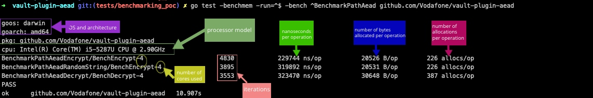
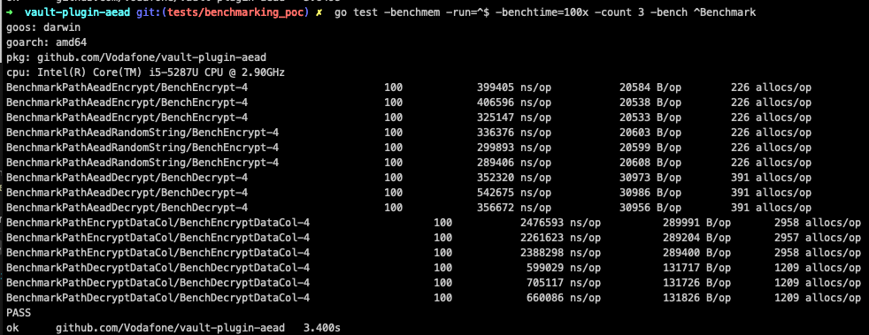
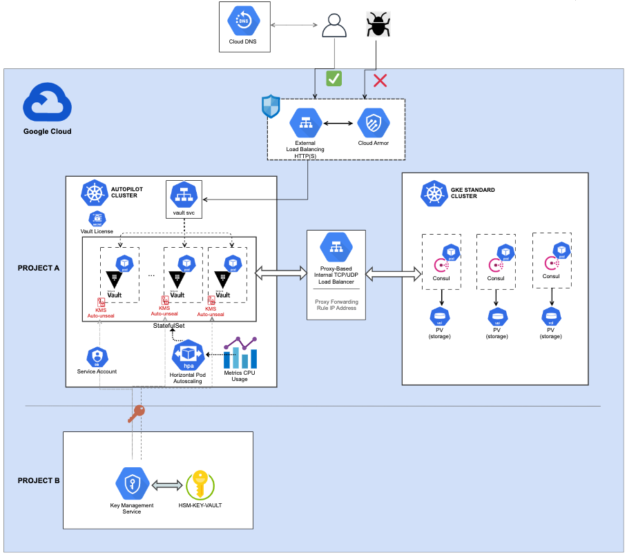
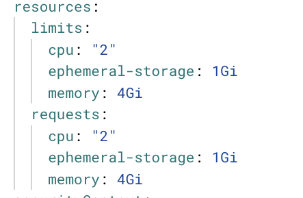
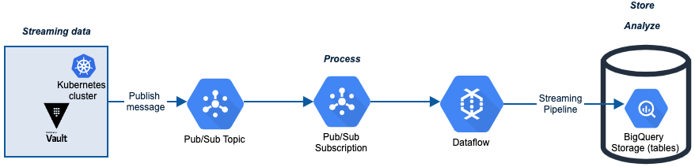

VAULT AEAD SECRETS PLUGIN
- [WHAT IS IT](#what-is-it)
- [INSPIRATION](#inspiration)
- [HIGH LEVEL REQUIREMENTS](#high-level-requirements)
- [QUICK START](#quick-start)
- [API endpoints](#api-endpoints)
  - [Data returned](#data-returned)
  - [Client APIS](#client-apis)
    - [General note an Additional Data](#general-note-an-additional-data)
    - [General note an Key Families](#general-note-an-key-families)
    - [/encrypt](#encrypt)
    - [/decrypt](#decrypt)
    - [/encryptcol](#encryptcol)
    - [/decryptcol](#decryptcol)
  - [ADMIN API's](#admin-apis)
    - [/info](#info)
    - [/config (read)](#config-read)
    - [/config (write)](#config-write)
    - [/configOverwrite](#configoverwrite)
    - [/configDelete](#configdelete)
    - [/createAEADkey](#createaeadkey)
    - [/createAEADkeyOverwrite](#createaeadkeyoverwrite)
    - [/createDAEADkey](#createdaeadkey)
    - [/createDAEADkeyOverwrite](#createdaeadkeyoverwrite)
    - [/rotate](#rotate)
    - [/keytypes](#keytypes)
    - [/bqsync](#bqsync)
    - [/updateKeyStatus](#updatekeystatus)
    - [/updateKeyMaterial](#updatekeymaterial)
    - [/updateKeyID](#updatekeyid)
    - [/updatePrimaryKeyID](#updateprimarykeyid)
    - [/importKey](#importkey)
    - [/readkv](#readkv)
    - [/synckv](#synckv)
    - [/synctransitkv](#synctransitkv)
  - [KEYSET EXAMPLE](#keyset-example)
  - [BULK DATA EXAMPLE](#bulk-data-example)
- [DESIGNS](#designs)
  - [Encrypt and Decrypt](#encrypt-and-decrypt)
  - [Admin API's](#admin-apis-1)
  - [BQ Encrypt and Decrypt](#bq-encrypt-and-decrypt)
- [PERFORMANCE TESTING](#performance-testing)
  - [Notes](#notes)
  - [Quick start](#quick-start-1)
      - [small test](#small-test)
      - [medium test](#medium-test)
      - [large test](#large-test)
  - [Options](#options)
- [BENCHMARKING](#benchmarking)
  - [Intro](#intro)
  - [Usage](#usage)
  - [Analyzing the Results](#analyzing-the-results)
    - [Decrypt/Encrypt tests based on bechmarks](#decryptencrypt-tests-based-on-bechmarks)
- [INFRASTRUCTURE](#infrastructure)
  - [Consul](#consul)
  - [Vault](#vault)
  - [HPA](#hpa)
  - [KMS](#kms)
- [TELEMETRY](#telemetry)
  - [Config example](#config-example)
  - [Message](#message)
  - [Workflow diagram](#workflow-diagram)

# WHAT IS IT
A custom secret engine plugin to Hashicorp Vault that enables data to be encrypted/decrypted with Google Tink AEAD keysets for anonymisation purposes. Functionality includes server side anonymisation, key lifecycle management, synchronisation with Big Query. Data is encrypted or decrypted transiently (no state), only the config and keys are held securely in vault.


# INSPIRATION

https://open.nytimes.com/we-built-a-plugin-but-its-not-a-secret-dfdf68b0e44f

(an epiphany that we could use the config to store keys and implement something akin to transit engine using those keys)

https://learn.hashicorp.com/tutorials/vault/plugin-backends?in=vault/secrets-management

https://github.com/hashicorp/vault-guides/blob/master/plugins/vault-plugin-secrets-mock

https://www.youtube.com/watch?v=oV9rvDllKEg

(Concurrency is not Parallelism by Rob Pike)


# HIGH LEVEL REQUIREMENTS

Houston we have a problem… we want to implement Google Tink encryption for PII data, but we have some specific and challenging requirements…

* To be able to use deterministic and non-deterministic keys to anonymise data (AES256GCMKeyTemplate and AESSIVKeyTemplate as defined in github.com/google/tink/go/keyset)
* To be able to encrypt and decrypt ad-hoc from BQ queries and DataStudio; To be able to decrypt in a client, data that has been encrypted in BQ, and visa versa, and similarly client-client and bq-bq: ie interoperability of keys
* To be able to encrypt and decrypt from ingestion frameworks based on dataproc, dataflow, cdap, 'a.n.other' client side process
* To be agnostic of where the client is; on-prem, GCP, AWS, Azure
* To be able to rotate keys and manage key lifecycle
* To have separate keys per field to be encrypted
* To have RBAC policies that allow separation of administration, encryption and decryption roles
* To have a rock-solid disaster recovery solution

And we need to do this at massive scale - just one of the typical data feeds is 350 files, each of 4 million rows of data, each with 6 fields to be encrypted. In 1 hour. Thats 8.4 billion encryptions in an hour, or a rate of 2.3 million per second. There are other shapes of data with less rows and more fields. Data comes in all shapes and sizes.
  

# QUICK START
Download and install a local vault from Hashicorp here:

https://www.vaultproject.io/downloads


```
git clone https://github.com/Vodafone/vault-plugin-aead.git
cd vault-plugin-aead
go test -v -cover -race
```

In one terminal
```
cd vault-plugin-aead
make
```
  
In another terminal
```
export VAULT_ADDR=http://127.0.0.1:8200
export VAULT_TOKEN=root
vault login
vault secrets enable -path=aead-secrets vault-plugin-aead
vault path-help aead-secrets
```

# API endpoints 
(note there are vault client CLI commands available too - vault read/write aead-secrets/<endpoint>)

If running against the local developer vault as per the quickstart then set this:
```
export VAULT_ADDR=http://127.0.0.1:8200
export VAULT_TOKEN=root
export AEAD_ENGINE=aead-secrets
```

## Data returned
Data is returned as json in this form:
```
{
  "request_id": "9554c944-c378-2999-e7de-f5b246634912",
  "lease_id": "",
  "renewable": false,
  "lease_duration": 0,
  "data": {
    "key": "value"
  },
  "wrap_info": null,
  "warnings": null,
  "auth": null
}
```
where key:value could be as below, depending on the endpoint and what it returns
```
"version":"0.0.1"
```
```
"field0":"DETERMINISTIC"
```
```
"field1":"cyphertext"
```
```
{"0":{"field0":"value00","field1":"value01","field2":"value02"},"1":{"field0":"value10","field1":"value11","field2":"value12"},"2":{"field0":"value20","field1":"value21","field2":"value22"}}
```

## Client APIS

### General note an Additional Data
AD is set to the same as the field, ie a key called field0 (think table column) will have 'field0' as its Additional Data

This may not always be desirable as perhaps in one table the same field is called different things - address-line1 in table a but address-l1 in table b

To cater for this the AD can be overridden for particular fields

In my example the following can be set up by an admin using the config endpoint

```
ADDITIONAL_DATA_address_line1 : ad-for-address-l1
ADDITIONAL_DATA_address_l1 : ad-for-address-l1
```

This would mean that both address-line1 and address-l1 columns would be encrypted or decrypted with the same additional-data = ad-for-address-l1

### General note an Key Families
By default you would set up 1 keyset per field to be encrypted
```
address_line: <keyset1>
lastname: <keyset2>
```
However, this would mean that for example multi-line addresses, or for addresses with slightly different field names in different feeds, we would have:
```
address_line1: <keyset1>
address_line2: <keyset2>
address_l1: <keyset3>
```
This may not be desirable, you may for example want all address fields to use the same key. This is done as follows, and circular references are defended against by only looking recursively 5 times
```
address_line1: address
address_line2: address
address_l1: address
address: <keyset>
```


### /encrypt
Lots of parallelisation. Splits bulk data into 1 goroutine per data row, and then every key:value pair is also a goroutine. So a file of 1000 rows and 6 fields is 6000 parallel goroutines. Unanswered questions about whether this is really executed in parallel for bulk data when in a container. Fields that do not have an encryption key are returned as-is and not errored. Note there is a 32Mb json restriction on http message size - the client is expected to handle this

```
curl -sk --header "X-Vault-Token: "${VAULT_TOKEN} --request POST ${VAULT_ADDR}/v1/${AEAD_ENGINE}/encrypt -H "Content-Type: application/json" -d '{"fieldname":"plaintext"}'
```
Returns
```
{
  "request_id": "b4486405-9451-f979-d047-7d4d12614d29",
  "lease_id": "",
  "renewable": false,
  "lease_duration": 0,
  "data": {
    "fieldname": "AfM7qawtjvuEMCudKjVl4lOA0ouLIMJqYrp4CMJQXHrjSN6beq6J/eff"
  },
  "wrap_info": null,
  "warnings": null,
  "auth": null
}
```
```
curl -sk --header "X-Vault-Token: "${VAULT_TOKEN} --request POST ${VAULT_ADDR}/v1/${AEAD_ENGINE}/encrypt -H "Content-Type: application/json" -d '{"fieldname1":"plaintext","fieldname2":"plaintext"}'
```
Returns:
```
{
  "request_id": "498186d2-e674-aa28-c9c6-2d97ce438f89",
  "lease_id": "",
  "renewable": false,
  "lease_duration": 0,
  "data": {
    "fieldname1": "AYnf2wLLJYxZdo/1PSLqYSFVuOSeiLsQzYuzf4CXvS8LKNoZyD4BfMi2",
    "fieldname2": "AeRVe0SnFMGnPSbHgUOwnMD/eACeAcA7788EOnwQNlv33MKRRsyo35cC"
  },
  "wrap_info": null,
  "warnings": null,
  "auth": null
}
```
```
curl -sk --header "X-Vault-Token: "${VAULT_TOKEN} --request POST ${VAULT_ADDR}/v1/${AEAD_ENGINE}/encrypt -H "Content-Type: application/json" -d 'BULK DATA - see below'
```
```
curl -sk --header "X-Vault-Token: "${VAULT_TOKEN} --request POST ${VAULT_ADDR}/v1/${AEAD_ENGINE}/encrypt -H "Content-Type: application/json" -d '{"0":{"field0":"value00","field1":"value01","field2":"value02"},"1":{"field0":"value10","field1":"value11","field2":"value12"},"2":{"field0":"value20","field1":"value21","field2":"value22"}}'
```
Returns:
```
{
  "request_id": "218407fe-7c07-7c06-196b-26255b5d2c4e",
  "lease_id": "",
  "renewable": false,
  "lease_duration": 0,
  "data": {
    "0": {
      "field0": "AXgd5oA9weobN1Y0fcITNV7iKEtjJDjvFLybLckfWPllk6Qu0LCvOw==",
      "field1": "AVo9v6O75dxQ/UMhmm1LR/m/9WsaZnzDoOdkBBqgOpmtvD303fyd+Q==",
      "field2": "AafzS5gTxaaLRbWYGUMqWpqo/cDCdHzD86Bd7OC4MvZ7srQIPr8H8g=="
    },
    "1": {
      "field0": "AXgd5oDVZUaMQkh2IANsjo4gwOtWYpL8PqqM/+Mn43z3RWr8mQSlww==",
      "field1": "AVo9v6Newmp6NIPhVfE4FXQp/FHTELEmdduVthEqfCOzXn+pbxZyjw==",
      "field2": "AafzS5hbUC2yn/b5LXHClg/LdTfBF8HL9sgMAZ7+sNjv6QmmawtEiw=="
    },
    "2": {
      "field0": "AXgd5oC93Hod69p9dsCsi2K7K9yqGgjQ8WevujGl19hFsMnO0DTbdg==",
      "field1": "AVo9v6MrW7+ak2IVdzkSiCj9T5rTppdikPskVGj6djWiPUKLttG0RQ==",
      "field2": "AafzS5gdCC3FeZWk0tsKSxKnm3yuI0EzWq8VW34Jy9IUbAeo+rNcaQ=="
    }
  },
  "wrap_info": null,
  "warnings": null,
  "auth": null
}
```
### /decrypt
Lots of parallelisation. Splits bulk data into 1 goroutine per data row, and then every key:value pair is also a goroutine. So a file of 1000 rows and 6 fields is 6000 parallel goroutines. Unanswered questions about whether this is really executed in parallel for bulk data when in a container. Fields that do not have an encryption key are returned as-is, and not errored. Note there is a 32Mb json restriction on http message size - the client is expected to handle this

See equivalent encrypt for return json format

```
curl -sk --header "X-Vault-Token: "${VAULT_TOKEN} --request POST ${VAULT_ADDR}/v1/${AEAD_ENGINE}/decrypt -H "Content-Type: application/json" -d {"fieldname":"cyphertext"}'
```
```
curl -sk --header "X-Vault-Token: "${VAULT_TOKEN} --request POST ${VAULT_ADDR}/v1/${AEAD_ENGINE}/decrypt -H "Content-Type: application/json" -d '{"fieldname1":"cyphertext","fieldname2":"cyphertext",...}'
```
```
curl -sk --header "X-Vault-Token: "${VAULT_TOKEN} --request POST ${VAULT_ADDR}/v1/${AEAD_ENGINE}/decrypt -H "Content-Type: application/json" -d 'BULK DATA - see below'
```

### /encryptcol
Column based encryption or decryption. Intended for bulk data only. Pivots the bulk data into columns - then parellizes 1 row (aka field) at a time, re-pivots before returning. Pivoting operations are transparent to to the client, So a file of 1000 rows and 6 fields is 6 parallel goroutines. This is 2x faster when running with a local vault, but only 20% faster in a containerised vault. Unexplained.
```
curl -sk --header "X-Vault-Token: "${VAULT_TOKEN} --request POST ${VAULT_ADDR}/v1/${AEAD_ENGINE}/encrypt -H "Content-Type: application/json" -d 'BULK DATA - see below'
```
```
curl -sk --header "X-Vault-Token: "${VAULT_TOKEN} --request POST ${VAULT_ADDR}/v1/${AEAD_ENGINE}/encryptcol -H "Content-Type: application/json" -d '{"0":{"field0":"value00","field1":"value01","field2":"value02"},"1":{"field0":"value10","field1":"value11","field2":"value12"},"2":{"field0":"value20","field1":"value21","field2":"value22"}}'
```
Returns:
```
{
  "request_id": "73531055-42f3-5e82-789b-d479818ebb18",
  "lease_id": "",
  "renewable": false,
  "lease_duration": 0,
  "data": {
    "0": {
      "field0": "AXgd5oC2hRgUTL1wApiU7WQ9UfVFOpRe07rl3Tp8EA7cH1AvTScB/w==",
      "field1": "AVo9v6OMQktkfU98vU6jacQLFavDDTEz57dAYrXZjaaC56ke9hVYLg==",
      "field2": "AafzS5i+/pdLYNvDB5rrAJH/nZcy36iPPDEuzmKI0cAOigAQG6wWpA=="
    },
    "1": {
      "field0": "AXgd5oBzPyo4CR/mOcjyDfpHnEX5yzdc7At5F0afg5VvRmzPiLaVPg==",
      "field1": "AVo9v6Os7L5COkcF1BJNDZ4fVmijIGWtivyoc4Bngk1bdsQqBRraMg==",
      "field2": "AafzS5hCp9vguVwzhm+XXZzd7khCGiB7oJs+A83x5o1GyzqytCoBbw=="
    },
    "2": {
      "field0": "AXgd5oBa9Bl6oukmxo/LxgeH5DJgRBgcgKD4ViRSnmkWTKYzqb0Zfg==",
      "field1": "AVo9v6MRQHBzG01AA5Fokfy8KZ/t4lJKjB2SI/2Clb+QCa+TXD9fkg==",
      "field2": "AafzS5hR0plC1/wy8CQpvdac2QGbOfHq4GLrMM1sgHTZ058A9nbyUw=="
    }
  },
  "wrap_info": null,
  "warnings": null,
  "auth": null
}
```

### /decryptcol
Column based encryption or decryption. Intended for bulk data only. Pivots the bulk data into columns - then parellizes 1 row (aka field) at a time, re-pivots before returning. Pivoting operations are transparent to to the client, So a file of 1000 rows and 6 fields is 6 parallel goroutines. This is 2x faster when running with a local vault, but only 20% faster in a containerised vault. Unexplained.

See equivalent encryptcol for return json format


```
curl -sk --header "X-Vault-Token: "${VAULT_TOKEN} --request POST ${VAULT_ADDR}/v1/${AEAD_ENGINE}/decrypt -H "Content-Type: application/json" -d 'BULK DATA - see below'
```


## ADMIN API's
### /info
returns the plugin version number as json.
```
curl -sk -X GET --header "X-Vault-Token: "${VAULT_TOKEN} ${VAULT_ADDR}/v1/${AEAD_ENGINE}/info
```
### /config (read)
returns the config as json - mostly keys. This is intended to be a restricted endpoint as it is in clear text. See  section on "LIMITATIONS AND TODO's"
```
curl -sk -X GET --header "X-Vault-Token: "${VAULT_TOKEN} ${VAULT_ADDR}/v1/${AEAD_ENGINE}/config
```

### /config (write)
writes key : value to config. Note this DOES NOT overwrite an existing key. Can also be used to import a key
```
curl -sk --header "X-Vault-Token: "${VAULT_TOKEN} --request POST ${VAULT_ADDR}/v1/${AEAD_ENGINE}/config -H "Content-Type: application/json" -d '{"key":"value"}'
```
### /configOverwrite
writes key : value to config. Note this could overwrite an existing key. Can also be used to import a key
```
curl -sk --header "X-Vault-Token: "${VAULT_TOKEN} --request POST ${VAULT_ADDR}/v1/${AEAD_ENGINE}/configOverwrite -H "Content-Type: application/json" -d '{"key":"value"}'
```

### /configDelete
Deletes the config entry
```
curl -sk --header "X-Vault-Token: "${VAULT_TOKEN} --request POST ${VAULT_ADDR}/v1/${AEAD_ENGINE}/configDelete -H "Content-Type: application/json" -d '{"key":""}'
```

### /createAEADkey
creates a non deterministic keyset with 1 key of type github.com/google/tink/go/aead.AES256GCMKeyTemplate() for field "fieldname-nondet" and saves it to config. Note this DOES NOT overwrite an existing keyset
```
curl -sk --header "X-Vault-Token: "${VAULT_TOKEN} --request POST ${VAULT_ADDR}/v1/${AEAD_ENGINE}/createAEADkey -H "Content-Type: application/json" -d '{"fieldname-nondet":"junktext"}'
```
### /createAEADkeyOverwrite
creates a non deterministic keyset with 1 key of type github.com/google/tink/go/aead.AES256GCMKeyTemplate() for field "fieldname-nondet" and saves it to config. Note this DOES NOT overwrite an existing keyset
```
curl -sk --header "X-Vault-Token: "${VAULT_TOKEN} --request POST ${VAULT_ADDR}/v1/${AEAD_ENGINE}/createAEADkeyOverwrite -H "Content-Type: application/json" -d '{"fieldname-nondet":"junktext"}'
```
### /createDAEADkey
creates a deterministic keyset with 1 key of type github.com/google/tink/go/daead.AESSIVKeyTemplate() for field "fieldname-det" and saves it to config. Note this WILL NOT overwrite an existing keyset
```
curl -sk --header "X-Vault-Token: "${VAULT_TOKEN} --request POST ${VAULT_ADDR}/v1/${AEAD_ENGINE}/createDAEADkey -H "Content-Type: application/json" -d '{"fieldname-det":"junktext"}' 
```
### /createDAEADkeyOverwrite
creates a deterministic keyset with 1 key of type github.com/google/tink/go/daead.AESSIVKeyTemplate() for field "fieldname-det" and saves it to config. Note this WILL overwrite an existing keyset
```
curl -sk --header "X-Vault-Token: "${VAULT_TOKEN} --request POST ${VAULT_ADDR}/v1/${AEAD_ENGINE}/createDAEADkeyOverwrite -H "Content-Type: application/json" -d '{"fieldname-det":"junktext"}' 
```

### /rotate
Spin through all the keys and rotate them. The config endpoint should show rotated keys
```
curl -sk --header "X-Vault-Token: "${VAULT_TOKEN} --request POST ${VAULT_ADDR}/v1/${AEAD_ENGINE}/rotate
```

### /keytypes
Spin through all the keys and return DETERMINISTIC or NON_DETERMINISTIC

```
curl -sk -X GET --header "X-Vault-Token: "${VAULT_TOKEN} ${VAULT_ADDR}/v1/${AEAD_ENGINE}/keytypes
```

### /bqsync
Sync Tink keysets, encrypted with KMS, as a routine in a defined BQ dataset so the same key can be used directly in BQ.
Because the user of BQ is granted the decryptor by delegation role on the KMS key, the user can invoke the routine to use the encrypted keyset to decrypty data, but cannot decrypt the keyset itself.


```
curl -sk --header "X-Vault-Token: "${VAULT_TOKEN} --request POST ${VAULT_ADDR}/v1/${AEAD_ENGINE}/bqsync
```


This default to the following, which can be set using the config endpoint

```
	BQ_KMSKEY : my-kmskey (default "projects/your-kms-project/locations/europe/keyRings/tink-keyring/cryptoKeys/key1")
    note that the vault service account must have encryptor-by-delegation role on this KMS
    note also that the kms key must be inthe same region as the datasets to which the routines will be attached
	BQ_PROJECT : my-project  (default "your-bq-project") the project that has the datasets into which we will create or replace the bq routines
	BQ_DEFAULT_ENCRYPT_DATASET : a-dataset (default "pii_dataset_eu")
	BQ_DEFAULT_DECRYPT_DATASET : a-dataset (default "pii_dataset_eu")
	BQ_ROUTINE_DET_PREFIX : a prefix for deterministic routines (default "pii_daead_")
	BQ_ROUTINE_NONDET_PREFIX : a preficxfor non-deterministic routines (default "pii_aead_")
```
  If you want to send a specific routine to a specific dataset you have to know the name of the routine it will try to create and set the following config eg:
```
  pii_aead_andy_nd4_encrypt : another-dataset
```  


### /updateKeyStatus
updates the status of a specific key within a specific keyset as ENABLED or DISABLED. New key is checked for validity before updating.
```
curl -sk --header "X-Vault-Token: "${VAULT_TOKEN} --request POST ${VAULT_ADDR}/v1/${AEAD_ENGINE}/updateKeyStatus -H "Content-Type: application/json" -d  '{"field1":{"4138735456":"DISABLED"}}'
```
```
curl -sk --header "X-Vault-Token: "${VAULT_TOKEN} --request POST ${VAULT_ADDR}/v1/${AEAD_ENGINE}/updateKeyStatus -H "Content-Type: application/json" -d  '{"field1":{"4138735456":"ENABLED"}}'
```
### /updateKeyMaterial
updates the key material of a specific key within a specific keyset as ENABLED or DISABLED. Note material must be valid

```
curl -sk --header "X-Vault-Token: "${VAULT_TOKEN} --request POST ${VAULT_ADDR}/v1/${AEAD_ENGINE}/updateKeyMaterial -H "Content-Type: application/json" -d  '{"field2":{"3233050044":"GiBNxwpdhnnTsrdKF/05N0h1cqO9o1awaR3nNDZOfy/Kaw=="}}'
```
### /updateKeyID
updates the keyID  of a specific key within a specific keyset to a new number. If the key ID is also the primary it updates the primary too.  New key is checked for validity before updating.

```
curl -sk --header "X-Vault-Token: "${VAULT_TOKEN} --request POST ${VAULT_ADDR}/v1/${AEAD_ENGINE}/updateKeyID -H "Content-Type: application/json" -d  '{"field2":{"3233050044":"3233050045"}}'
```
### /updatePrimaryKeyID
updates the primary keyID  of a specific keyset to a new number.  New key is checked for validity before updating.

```
curl -sk --header "X-Vault-Token: "${VAULT_TOKEN} --request POST ${VAULT_ADDR}/v1/${AEAD_ENGINE}/updatePrimaryKeyID -H "Content-Type: application/json" -d  '{"field2":"2817739672"}'
```
### /importKey
Imports a key as json to a field - in the example below importing a keyset of 3 keys.  New key is checked for validity before importing.
```
curl -sk --header "X-Vault-Token: "${VAULT_TOKEN} --request POST ${VAULT_ADDR}/v1/${AEAD_ENGINE}/importKey -H "Content-Type: application/json" -d  '{"field3":"{\"primaryKeyId\":1513996195,\"key\":[{\"keyData\":{\"typeUrl\":\"type.googleapis.com/google.crypto.tink.AesGcmKey\",\"value\":\"GiD2rBnfl5oi1tMfHwcFcyqS+JpQpWUcAj8zzd8D3q3IQA==\",\"keyMaterialType\":\"SYMMETRIC\"},\"status\":\"ENABLED\",\"keyId\":2480583041,\"outputPrefixType\":\"TINK\"},{\"keyData\":{\"typeUrl\":\"type.googleapis.com/google.crypto.tink.AesGcmKey\",\"value\":\"GiBQUDTlxVawIr3T1/dRvuF5CzBhTZtnnpuVsNZayxv1LQ==\",\"keyMaterialType\":\"SYMMETRIC\"},\"status\":\"ENABLED\",\"keyId\":133713585,\"outputPrefixType\":\"TINK\"},{\"keyData\":{\"typeUrl\":\"type.googleapis.com/google.crypto.tink.AesGcmKey\",\"value\":\"GiBs9EEVquF+igDsDI+FskdsDjVOf6vxLZQHkbJrrIoQLQ==\",\"keyMaterialType\":\"SYMMETRIC\"},\"status\":\"ENABLED\",\"keyId\":1513996195,\"outputPrefixType\":\"TINK\"}]}"}'
```

### /readkv
Reads and returns the keys that are stored in the vault kv defined below
```
curl -sk --header "X-Vault-Token: "${VAULT_TOKEN} --request POST ${VAULT_ADDR}/v1/${AEAD_ENGINE}/readkv
```
Note the following config must be set:
```
"VAULT_KV_ACTIVE"
"VAULT_KV_URL"
"VAULT_KV_ENGINE"
"VAULT_KV_VERSION"
"VAULT_KV_APPROLE_ID"
"VAULT_KV_SECRET_ID" // optional if this can be derived from the below
"VAULT_KV_WRITER_ROLE"
"VAULT_KV_SECRETGENERATOR_IAM_ROLE"
```

### /synckv
Synchronises the keys in kv defined below to the plugin engine
```
curl -sk --header "X-Vault-Token: "${VAULT_TOKEN} --request POST ${VAULT_ADDR}/v1/${AEAD_ENGINE}/synckv
```
Note the following config must be set:
```
"VAULT_KV_ACTIVE"
"VAULT_KV_URL"
"VAULT_KV_ENGINE"
"VAULT_KV_VERSION"
"VAULT_KV_APPROLE_ID"
"VAULT_KV_SECRET_ID" // optional if this can be derived from the below
"VAULT_KV_WRITER_ROLE"
"VAULT_KV_SECRETGENERATOR_IAM_ROLE"
```

### /synctransitkv
Defines the keys that will be synced from now on in the config, and then syncs them to the kv store defined below to the plugin engine, note that the keys are also wrapped using transit
```
curl -sk --header "X-Vault-Token: "${VAULT_TOKEN} --request POST ${VAULT_ADDR}/v1/${AEAD_ENGINE}/synctransitkv -H "Content-Type: application/json" -d '{"key1":"true", "key2":"true"}'
```
Note the following config must be set:
```
"VAULT_TRANSIT_APPROLE_ID"
"VAULT_TRANSIT_SECRET_ID"
"VAULT_TRANSIT_KV_ENGINE"
"VAULT_TRANSIT_KV_PUSH_PATH"
"VAULT_TRANSIT_KV_PULL_PATH"
"VAULT_TRANSIT_KV_VERSION"
"VAULT_TRANSIT_NAMESPACE"
"VAULT_TRANSIT_ENGINE"
"VAULT_TRANSIT_TOKENNAME"
"VAULT_TRANSIT_KEK"
```


## KEYSET EXAMPLE
Note that a keyset for 1 field, with in this case 2 keys looks like this (this is not in use - so safe to publish here):

```
{
  "primaryKeyId": 1945832436,
  "key": [
    {
      "keyData": {
        "typeUrl": "type.googleapis.com/google.crypto.tink.AesSivKey",
        "value": "EkAfBnBWWzhrQ1/qCI6JlkaOBDyIWiiTU6ACE7dIy6zf3eMbTSlthSyfGx59fAnud/C7W4mht77MWgrwAYjmTC1z",
        "keyMaterialType": "SYMMETRIC"
      },
      "status": "ENABLED",
      "keyId": 1502426463,
      "outputPrefixType": "TINK"
    },
    {
      "keyData": {
        "typeUrl": "type.googleapis.com/google.crypto.tink.AesSivKey",
        "value": "EkDGZLv9Qi6Xsk7GNC3J8mIx2B6pGAuEr5nM8aN6q5MkMto22s6wU+BNYLgwsq4+qrbxzDdhPArAx5RCBYBd/16C",
        "keyMaterialType": "SYMMETRIC"
      },
      "status": "ENABLED",
      "keyId": 1945832436,
      "outputPrefixType": "TINK"
    }
  ]
}
```


## BULK DATA EXAMPLE

See performance.go makeRandomData() for an example of how to create bulk data 


```
{"0":{"field0":"value00","field1":"value01","field2":"value02"},"1":{"field0":"value10","field1":"value11","field2":"value12"},"2":{"field0":"value20","field1":"value21","field2":"value22"}}
```

or more explicitly

```
{
	"0": {
		"field0": "value00",
		"field1": "value01",
		"field2": "value02"
	},
	"1": {
		"field0": "value10",
		"field1": "value11",
		"field2": "value12"
	},
	"2": {
		"field0": "value20",
		"field1": "value21",
    "field2": "value22"
	}
}
```

if the column based endpoints are used, internally this will be pivoted to the below, and the pivoted back so it is transparent to the client

```
{
	"field0": {
		"0": "value00",
		"1": "value01",
		"2": "value02"
	},
	"field1": {
		"0": "value10",
		"1": "value11",
		"2": "value11"
	},
	field2": {
		"0": "value20",
		"1": "value21",
    "2": "value22"
	}
}
```


The code identifies that we are dealing with bulk data because the first value of a map is asserted to be another map
Ie all data passed to vault is map[string]interface{}
but if it is bulk data the interface{} is also a map[string]interface{}

Note that in Vault, data is passed in and returned back as...

```
map[string]interface{}
```

For a set of key:value pairs such as this...
```
curl -sk --header "X-Vault-Token: "${VAULT_TOKEN} --request POST ${VAULT_ADDR}/v1/${AEAD_ENGINE}/decrypt -H "Content-Type: application/json" -d '{"fieldname1":"cyphertext","fieldname2":"cyphertext",...}'
```
where the keys are the fields and the values are the text - in other words tha map is asserted to be...
```
map[string]string
```

However, for bulk data it is still of type...
```
map[string]interface{}
```
but interface{} is actually another map - so it is asserted to be...
```
map[string]map[string]interface{}
```


# DESIGNS
## Encrypt and Decrypt


## Admin API's


## BQ Encrypt and Decrypt
Using the keys synced over using the bqsync endpoint


The purpose of this is not to dwell on the BQ side of things but the bqsync endpoint puts the SAME KEY into BQ so that operations like this can be done
```
select "value1" as ORIGINAL,
        pii_dataset_eu.pii_aead_field0_encrypt("value1",'field0') as ENCRYPTED,
        pii_dataset_eu.pii_aead_field0_decrypt(pii_dataset_eu.pii_aead_field0_encrypt("value1",'field1'),'field1') as ENCRYPTED_DECRYPTED
```
**in other words, a value encrypted in the vault api, can be decrypted in a BQ function, and vice versa**


# PERFORMANCE TESTING

**10 Million encryptions/decryptions per second have been achieved with a large performance test rig and pods of 500 x 3 CPU**

See Infrastucture section for Enterprise Vault requirements to get high throughput


## Notes
I can't honestly say this was designed from the ground up, it sort of evolved into a bit of a swiss army knife. It's almost certainly not a reference implementation of a test framework, it assumes happy path, and I wouldn't dream of using it in production. But it is enough for now.

Having said that - it does some cool things in quite a hacky way - inspecting the spec of the client machine, inspecting the spec and number of k8s pods, gathering average kube metrics, saving the results

Also, it does have, and needs, 2 exponential backoff retrys - because all sorts of things can happen in distributed computing
1. uses Hashi's hashicorp/go-retryablehttp http retry client so that http errors are caught and retried - test this by putting an invalid url for vault in
2. uses Go's cenkalti/backoff/v4 package to wrap the http retry, so that errors returned from vault (but that are successfull http calls) are retried - put an invalid token in to see this in action.

**BEFORE TESTING - DON'T FORGET TO SET THE KEYSETS UP FIRST USING THE createAEADkey or createDAEADkey for each field 'field0....fieldn'**
## Quick start
```
git clone https://github.com/Vodafone/vault-plugin-aead.git
cd vault-plugin-aead/cmd/performance
go build
(or if destined for Linux: env GOOS=linux GOARCH=amd64 go build)
```

#### small test 
(-d = debug mode to see what is going on)
6 fields, 3 rows, 2 concurrent processes, 1 iteration, bulk mode, column based end point
```
./performance -f 6 -r 3 -c 2 -i 1 -t <token> -u <https://url> -b -col -d
```
If running against a local vault as per the quick-start, this would be:
```
./performance -f 6 -r 3 -c 2 -i 1 -t root -u http://127.0.0.1:8200 -b -col -d
```

#### medium test
```
./performance -f 6 -r 1000 -c 100 -i 10 -t <token> -u <https://url> -b -col
```

#### large test
30x concurrent execution of (hint use the -w option to set the same UTC start time for all runs)
typically...
10 from on prem
10 from project a, instance group of 10 vm'sV
10 from project b, instance group of 10 vm's

**NOTE the -s switch - you will need to have a table created and writable - see results-table.ddl**

```
./performance -f 6 -r 1000 -c 100 -i 100 -t <token> -u <https://url> -b -s -col -w "YYYY-MM-DD HH24:MI"
```
## Options
Usage of ./performance:
```
  -b	send all data as 1 batch (32Mb json limit)
  -c int
    	number of concurrent clients (default 1)
  -col
    	column based ops (only if batchMode = true)
  -d	debug
  -f int
    	number of fields per row (default 1)
  -i int
    	number of iterations (default 1)
  -k	collect kube stat averages - assumes VAULT is runnining in k8s and the .kube/config exists on the client side and you have permissions on k8s - note this seems to have a significant impact in performance - especially for the large scale tests
  -n string
    	root name for fields to be anonynised - default field so names would be field0, field1, field2.....fieldn (default "field")
  -p string
    	proxy url - something like http://someproxy.vodafone.com:8080
  -r int
    	number of rows per dataset (default 1)
  -s	save results to bq <value-as-project-id>.aead_tests.results - assumes the user or SA this runs as can access this table - need to change this if you use a different table and rebuild. You will need to have a table created and writable - see results-table.ddl as per -k - also needs the k8s .kube/config to exist as it does a one-time inspection of the kube statefuleset
  -t string
    	token for vault access
  -u string
    	url for vault access (default "http://127.0.0.1:8080")
  -w string
    	UTC datetime in the format of 2022-03-28 11:05 YYYY-MM-DD HH24:MM to delay until - useful to set up a large scale run. Starts immediately if this time is in the past.
```
# BENCHMARKING

## Intro
Benchmarks in Go are done with the testing package, much like regular unit tests. Just like unit tests, benchmarks are triggered with the same Go test tooling. By adding benchmarks, we can leverage these metrics to see about time consumed, number of iteration/request(i.e. execution of function) and inform us about how to improve code.

## Usage 
To run a benchmark, we need append the -bench flag to the go test command. The argument to -bench is a regular expression that specifies which benchmarks should be run, which is helpful when you want to run a subset of your benchmark functions.

`go test -benchmem -run=^$  -bench ^BenchmarkPathAead`

## Analyzing the Results
The benchmark will be outputted with the name of the function that was running, which we can use to identify the different ones. 
goos, goarch, pkg, and cpu describe the operating system, architecture, package, and CPU specifications, respectively.

On the right side of the function name we have iteration column. This number represents the number of time the for loop has run to obtain the statistics. Then we have Nanoseconds per operation and Number of bytes allocated per operation. The former indicates you an idea of how fast on average your solver run, while the latter give you an idea about the memory consumption.

last column of this stat speaks for itself. This is the average number of memory allocations per run. 



### Decrypt/Encrypt tests based on bechmarks




# INFRASTRUCTURE
For proper deployment, not local testing, we use Vault Enterprise v1.12.0 and Consul v1.10
This is deployed on GCP's GKE

Note that the solution works on community and enterprise vault, but only the enterprise version supports the concept of performance replicas. 
To get high throughput, the performance replica feature is required because without this feature all traffic is routed through the master vault pod, but the performance is gained via Kubernetes horizonal scaling, and the traffic being routed through hundreds of pods

Components: 
* Cloud DNS is providing high-availability of domain and pointing to the correct external load balancer 
* Cloud Armor offer in-built support against DDoS attacks and allows for protection with default Cloud Armor config 
* External Load Balancing uses HTTPS with SSL certificate
* Vault Enterprise License is stored in Secret which is used by Helm Chart of Helm Deployment to configure proper Vault Enterprise which is used in this project
In this proposed infrastructure there are prepared two Kubernetes Cluster: GKE Standard and GKE Autopilot. Vault is installed on the former one  while consul is installed on the latter.

The proposed infrastructure shows two clusters (Consul, Vault) which are connected and can communicate with each other by an internal load balancer pointing to vault-consul-lb which handles distribute traffic between consuls servers




## Consul
deployed in a fixed cluster (because it does not support autopilot yet), and a small one at that - even for the high throughput, high-volume tests, consul is barely doing anything


## Vault
deployed in a GKE Autpilot cluster so we can scale from 3 - 300 pods and back again quickly and also vary the pod specs without worrying about node servers. Also the pods have a spec of 2CPU, 4G RAM




## HPA

HPA (Horizontal Pod Autoscaling) Scales pods depends on the CPU usage from Metrics Server API, if CPU usage is more than 40% than new replicas pods are created. 

## KMS

Additional GCP Project is used to store Vault key which is used for storing KMS key. Vault supports opt-in automatic unsealing via KMS from GCP. This feature enables operator to delegate the unsealing process to trusted keys in the event of partial failure and to aid in the creation of new or ephemeral clusters. Hardware security modules (HSMs) are intrusion-resistant hardware components that we use to protect and store cryptographic keys while still making them available for use by authorized users. The purpose is to control access and limit risk to sensitive private keys. More information: https://www.vaultproject.io/docs/enterprise/hsm


# TELEMETRY
As of v0.1.3 telemetry can be published for each call to encryption or decryption. This is published to a PubSub topic in the form of a JSON message.

This is used to:

a) confirm the performance claims

b) provide a mechanism to determine usage per market for chargeback purposes

Dataflow can be configured to consume this and save to a BigQuery for analysis

## Config example
```
TELEMETRY_LM : TEST (this is the same as the secret engine)
TELEMETRY_PROJECTID : your-pubsub-project
TELEMETRY_TOPICID : eaas-telemetry
```

## Message
```
{
  "uuid": "1c8c910a-0781-4065-8dec-f3b1a1fab338",
  "market": "TEST",
  "pubDate": "2022-06-04 18:46:35.587133 +0000 UTC",
  "encryptOrDecrypt": "encrypt",
  "reqSize": 8,
  "reqRows": 1,
  "reqFields": 1
}
```

## Workflow diagram

Dataflow Job has been built on Dataflow template gs://dataflow-templates-europe-west1/latest/PubSub_Subscription_to_BigQuery which allows for pushing data (encryption or decryption) from Vault cluster to the specific Pub/Sub Topic. Pub/Sub delivers the events from Vault and then output the transformed data (JSON) to BigQuery table.


